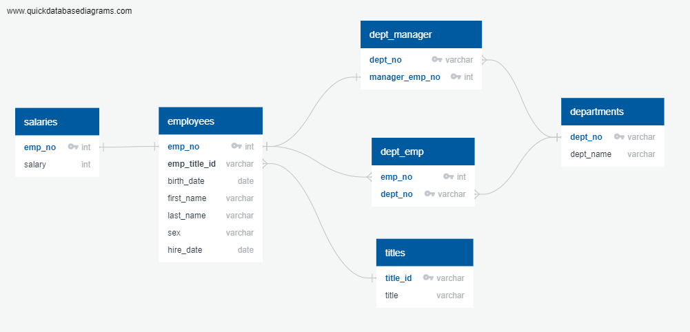

# sql-challenge

## Challenge Details

This challenge was to create a database to organize employee data from the 1980s and 1990s at a fictitious company, Pewlett Hackard. Once the database was created, queries were performed to gain insights into the data.

To perform these actions, [PostgreSQL](https://www.postgresql.org/) was employed, in conjunction with [pgAdmin](https://www.pgadmin.org/).

### Steps to create Database and Load Data

First, a new database was created in pgAdmin, named PH_Employees_db.

Next, the basic outline of the database tables was sketched using an entity relationship diagram. To do this, an [ERD Drawing tool](http://www.quickdatabasediagrams.com) was used. This diagram can be found in the EmployeeSQL folder and seen below. 

This diagram shows primary keys in each table and relationships between tables using foreign keys (signfied by lines connecting to corresponding parameter in related table). Two tables show 2 primary keys - in this case, this is a composite key, which takes 2 primary keys to uniquely identify the row. The data type can also be seen for each parameter in each table. Note: No length was specified for the varchar data types in these tables (such as varchar(30)). In normal practice, this should be specified to ensure imported data is not longer than an intended length.

Once the ERD is sketched out, the ERD drawing tool allows the user to export a schema file, which can be used in pgAdmin to create the tables that will hold the employee data. This schema was used to create tables in PH_Employees_db.

Once the tables were created, the data (contained in 6 csvs) was imported to the tables. Note: the tables must be imported in the following order, to avoid errors due to foreign key constraints:
    a. departments
    b. titles
    c. employees
    d. salaries
    e. dept_emp
    f. dept_manager
    

    

4. I added the csv files to my gitignore file due to their size so these files are not located in my git repo
